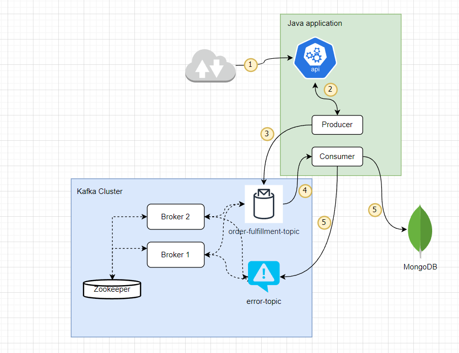

# springboot-springcloud-kafka-webflux

## Setting up

1. Spring boot, webflux & spring cloud stream
2. Java 17
3. MongoDB
4. Maven
5. Docker
6. Kafka

## How to run application locally

1. Run the docker compose file to get all project external dependencies. The docker compose file is available in
   the [infra](infra/docker-compose)
   folder.
   There are two versions of docker compose file is provided to run the minimum and extensive
   infrastructure. [For more details](infra/docker-compose/README.md)
2. Use preferred IDE to
   run [OrderServiceApplication.java](src/main/java/com/ns/os/OrderServiceApplication.java)
   OR use command prompt to run
3. Use [postman collection](infra/postman/postman_collection.json) for sending despatch advice events

4. Use MongoDB client or Kafka client to view the events

```shell 
mvn spring-boot:run

```

## Configuration

* For testing purposes, the offset reset policy( i.e. auto-offset-reset) is configured as "earliest", it means the
  Kafka consumer doesn't have offset value and will always start events from the first event.Change this configuration
  to "latest" to read the latest events only.

* Kafka Consumer is configured to read events in batches and can read 3 max events at a time.

## Application Architecture



### Application event flow

* Despatch advice event send using rest-endpoint defined
  in [DespatchAdviceRoute](src/main/java/com/ns/os/api/controller/DespatchAdviceRoute.java)
* Event send to the Kafka, logic defined
  in [DespatchAdviceHandler](src/main/java/com/ns/os/api/controller/DespatchAdviceHandler.java)
* Event consume by the application
  using [DespatchAdviceEventConsumer](src/main/java/com/ns/os/kafka/consumer/DespatchAdviceEventConsumer.java). 
  Events are , error events to and store it in MongoDB database

## DO-TO List

1. Fix Kafka test container not able to read the CustomDeserializer

``` 
java.lang.ClassCastException: class java.lang.Byte cannot be cast to class com.ns.os.domain.DespatchAdvice (java.lang.Byte is in module java.base of loader 'bootstrap'; com.ns.os.domain.DespatchAdvice is in unnamed module of loader 'app')
at java.base/java.util.ArrayList.forEach(ArrayList.java:1511) ~[na:na]
at com.ns.os.consumer.DespatchAdviceEventConsumer.lambda$processDespatchAdvice$2(DespatchAdviceEventConsumer.java:31) ~[classes/:na]
```


